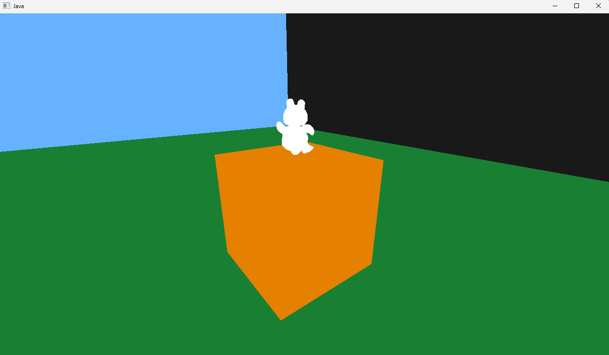

# Lightweight Java OpenGL Starter

**Before Use**: Install from https://www.lwjgl.org/customize Jar Packages, create a `lib/` folder and extract all Jar files into it.

```ps
javac -d bin -cp "lib/*" src\*.java 
java  --enable-native-access=ALL-UNNAMED  -cp "bin;lib/*" Main
```

### Demo (WIP - Rendered Teddy Bear)


### Example Tree:
```sh
.
├── README.md
├── bin
│   ├── DisplayManager.class
│   └── Main.class
├── lib
│   ├── lwjgl-assimp-natives-windows.jar
│   ├── lwjgl-assimp.jar
│   ├── *.jar ...
│   └── lwjgl.jar
└── src
    ├── DisplayManager.java
    └── Main.java

```